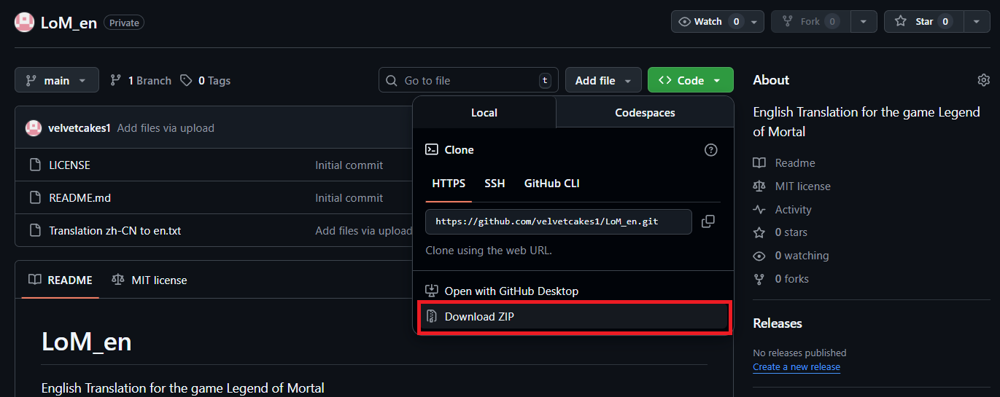
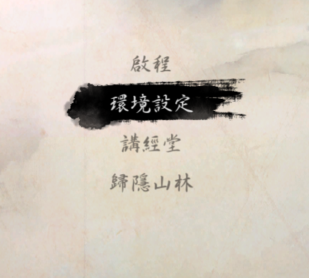
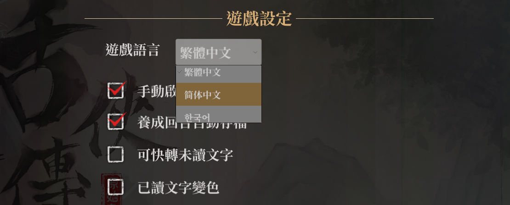

# Legend Of Mortal - EN
English Translation for the game Legend of Mortal.

## Prerequisites

These are included in this repository and you do not need to download them separately. Links are below if you still want to get them on your own.

- BepInEx [Click Here](https://github.com/BepInEx/BepInEx)

- XUnity.AutoTranslator - [Click Here](https://github.com/bbepis/XUnity.AutoTranslator)

What you actually need is just XUnity.AutoTranslator. There are several ways to install it without a plugin framework like BepInEx but I haven't tested them.

## Installation

If you plan to download the prerequisites yourself, please note that the game executable is 32-bit. And the XUnity.AutoTranslator config language needs to be "zh-CN" for Simplified Chinese. This is case sensitive.

1. Clone or Download this repository by clicking on "<> Code" and under HTTPS Download ZIP. Right click and extract the Zip file. You only need the BepInEx folder, feel free to delete everything else.


2. Copy and Paste everything inside the Mod folder in your game directory. The game location may vary. It's usually in `C:\Program Files (x86)\Steam\steamapps\common\` but if you are unsure right click and select properties from your Steam Library. Under 'Installed Files' click on 'Browse'. The game folder structure should look like this.

```
Legend_of_Mortal/
├─── BepInEx/
├─── ├─── cache
├─── ├─── config/
├─── ├─── core/
├─── ├─── patchers/
├─── ├─── plugins/
├─── ├─── ├─── XUnity.AutoTranslator
├─── ├─── ├─── XUnity.ResourceRedirector
├─── ├─── ├─── README (AutoTranslator).md
├─── ├─── Translation/
├─── ├─── ├─── en
├─── ├─── ├─── ├─── Text
├─── ├─── ├─── ├─── ├─── _AutoGeneratedTranslations.txt
├─── ├─── ├─── ├─── ├─── _Postprocessors.txt
├─── ├─── ├─── ├─── ├─── _Preprocessors.txt
├─── ├─── ├─── ├─── ├─── _Substitutions.txt
├─── ├─── ├─── ├─── ├─── Translation_zh-CN_to_en.txt
├─── ├─── LogOutput.log/
├─── Mods/
├─── MonoBleedingEdge
├─── Mortal_Data
├─── .doorstop_version
├─── changelog.txt
├─── doorstop_config.ini
├─── Mortal.exe
├─── UnityCrashHandler32.exe
├─── UnityPlayer.dll
└─── winhttp.dll
```

3. Start the game and select the 2nd option in the Title Screen.



4. Click the drop down menu on the top and again select the 2nd option for Simplified Chinese.




### Other notes

The source of the text in Chinese is from version 1.0.5000.2 which is right after the Ye Yunshang / Qingcheng route. There may be new additional text which were added later but those would remain untranslated. As of now I have no plans of adding text from new versions.

The translation has been done by an LLM and I'm still in the process of reviewing the story for accuracy but this will take an enormous amount of time for a single person. I've already reviewed and fixed a good chunk of the dialogue and in my opinion it's in a comprehensible state right now.


### As of 28/09/2025 25%~ of the translated text has been reviewed and fixed. 
I'll update this from time to time as I make progress.